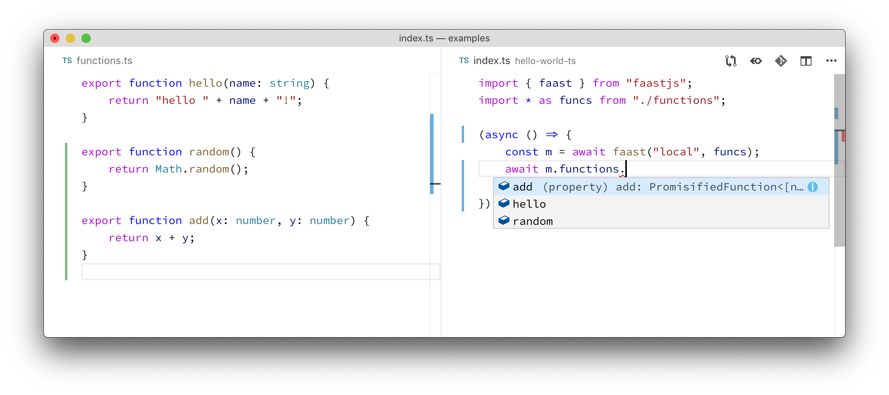

Functions as a Service platforms have changed the way we think about developing long-running services with an event-based architecture. But they're surprisingly challenging to use for batch use cases like software testing, ETL, and processing unstructured data. Let's take a look at why serverless functions can be a good fit for batch workloads, and some of the hurdles involved in using them effectively.

<!--truncate-->

I started faast.js because I had some large scale software testing to do. Serverless functions seemed like a good fit because they could spin up 1000 cores to perform the work in parallel, then spin down so there would be no ongoing cost. Even better, all infrastructure would be managed by the cloud provider. It seemed like a dream come true: a giant computer that could scale up and down at will.

But trying to build this on AWS Lambda was challenging:

-   **Complex setup:** Lambda throws you into the deep end with IAM roles, permissions, command line tools, web consoles, and special calling conventions. It became clear that Lambda and other FaaS are oriented towards an event-based processing model with always-on services, much of which becomes incidental complexity for batch oriented workloads.

-   **Primitive package dependency support:** everything had to be packaged up manually in a zip file. Every change to the code or tests would require a manual re-deploy.

-   **Native packages:** common testing tools like puppeteer are supported only if they are compiled specially for Lambda. This adds an additional complexity burden that is only partially resolved with Lambda Layers.

-   **Persistent infrastructure:** logs, queues, and functions are left behind in the cloud after a job is complete. These would need to be managed or removed, creating an unnecessary ops burden.

-   **Cost opacity:** allocating more memory to a Lambda function also increases the amount of CPU available and the cost per 100ms. This makes it hard to judge whether increasing memory will increase cost (because of the higher price), or decrease cost (because the workload finishes faster).

-   **Performance opacity:** bandwidth between Lambda and S3 storage is limited with lower amounts of memory. There are also many rate limits that are not obvious at first glance, but arise when creating and deleting functions, log groups, IAM roles, and using pricing APIs. And the number of invocations per second are different when invoking Lambda functions synchronously with https vs. using asynchronous invocations from SNS, for example.

-   **Type safety:** arguments and return values of Lambda functions are not type checked from end to end, making it easy to fall prone to common programming errors.

-   **Offline execution:** being able to develop and debug serverless functions while disconnected can be convenient for developers on the go and while experimenting with rapid code changes.

-   **Developer productivity:** debugging, high quality editor support, and other basic productivity tools are awkward or missing from serverless function development tooling.

-   **Scaling:** while serverless functions are auto-scaling, they don't deal with common batch processing issues like tail latency. For example, if 99.9% of requests finish quickly but the last 0.1% take an extraordinarily long time, the batch process is held up until the stragglers complete.

-   **Serverless architecture limitations:** at this time there are some severe limitations on what serverless functions can do on most platforms. There are limits on runtime, memory, and local storage. Lambdas can't communicate directly with each other and need to go through queues, cloud storage, or other services. It's not possible to run many distributed algorithms efficiently on serverless today.

The vision for faast.js is to make serverless batch processing is as simple as possible, freeing developers to program large scale computers with as little incidental complexity as possible. When serverless platforms release new functionality and concepts, the idea is for faast.js to evolve with them, growing in capability as the underlying infrastructure allows.

## Design principles for faast.js

### Deep interfaces

Faast.js presents a "deep" interface (see [Ousterhout's notes on Modular Design](https://web.stanford.edu/~ouster/cgi-bin/cs190-winter18/lecture.php?topic=modularDesign)). The surface of the API is small and simple, hiding as much internal complexity as possible while giving the developer as much power as possible. The main interface to faast.js is a single function, `faast()`:

```typescript
faast("aws", funcs);
```

The first argument of this function is the cloud to transform to. The second argument is the JavaScript module to transform into a serverless function. From the user's perspective, the only thing required is a cloud provider account. Then each function exported is automatically available for invocation as a serverless function:



On the left we have an ordinary JavaScript module. On the right is the code that invokes these functions in a serverless function. As the developer types `m.functions.`, autocomplete pops up all of the exports from the module. They can quickly select the function to call, and the IDE continues to provide contextual help with the type of the arguments and return value. If the functions change, type errors pop up at the invocation sites to prompt the user to update the code. Instant feedback on code changes across the serverless function call boundary makes developing with faast.js exceptionally efficient.

### Ephemeral infrastructure

When `faast()` is invoked, it starts creating the infrastructure it needs:


The exact infrastructure created depends on the cloud provider and the options you provide. But the beautiful thing is **users of faast.js don't need to manage any of this infrastructure**. You don't even need to run a command to initialize it. Faast.js will automatically create new infrastructure for you on the fly, so there is no "deploy" step with faast.js; every time you invoke `faast()`, code is bundled and infrastructure is deployed.

Unlike infrastructure-as-code systems, faast.js never attempts to modify existing infrastructure to bring it into alignment with a desired state. Infrastructure created by faast.js is immutable; it is only created and deleted, but never modified once in place. This immutability means faast.js infrastructure can never be out of sync or out of date.

The benefits of emphemeral infrastructure are many. New faast.js instances will start with a clean slate, without contamination of global variables or local filesystems with data leaked from prior function invocations. New code versions are deployed immediately, reducing the friction of rapid iteration. And multiple instances of the same workflow can be started at the same time without interference.

From a security standpoint, infrastructure that isn't there very long is harder to exploit. Like all serverless platforms, infrastructure patching is handled by the cloud provider. But faast.js goes further because code is re-bundled every time it's deployed, reducing the problem of keeping software up to date to keeping local package dependencies up to date, without having to worry about migration and upgrade of long-running services.

To be fair, infrastructure-as-code systems are optimized for different use cases than faast.js; there are good reasons they work the way they do. Faast.js is not meant for building event-based systems that are continually "on". It is much better suited to situations where work is split into separate jobs that are independent and have a finite amount of work to perform before being completed. Some streaming applications can also be a good fit, if the work consists of finite chunks.

All of this happens asynchronously, which is why `faast()` returns a `Promise`. By awaiting it you'll get an object that can be used to call functions, perform cleanup, and get cost data about the function. After your process is done, you can call `cleanup()` to remove almost all of these resources automatically. And there's even a garbage collector to clean up infrastructure remnants left over from crashes and incomplete cleanup. All of it is designed to reduce operational overhead, so developers can keep focusing on the code that matters.

This might seem to be wasteful or slow. But cloud providers have been working for years on making these infrastructure steps faster, and on AWS the infrastructure needed to create a cloud function from scratch can take as little as 2 seconds.

## Use cases

There are many ways to use faast.js. Here are a few ideas to get you started.

-   Software testing. Often unit tests and integration tests are independent and can be run in parallel. Headless Chrome can run in Lambda with faast.js, which makes it easy to grab screenshots of web pages. Have a few hundred or a few thousand workers do this in parallel and snapshot tests can be performed much faster. While faast.js has no specific integrations with test runners, we look forward to users exploring this.

-   Generating load. Faast.js reduces the burden of setting up a complex and expensive load testing environment. Developers can quickly see how their application performs under load before they even check in their code.

-   Processing documents and other unstructured data. For example, the arXiv repository (~1TB of PDFs) can be processed by lambda functions in under 50 seconds starting from S3. The high effective bandwith and aggregate amount of memory and CPU available makes it possible to run transformations, analysis, ETL, and other workloads at a massive scale, with no infrastructure overhead.

-   Image and video processing. [Sharp](https://github.com/lovell/sharp) and other image processing libraries can be used with faast.js to handle large image repositories quickly. Videos will require more work, but there has been promising work done on using [serverles for fast video processing](https://www.sysnet.ucsd.edu/~voelker/pubs/sprocket-socc18.pdf).

We can't wait to see what you do with faast.js.

If you'd like to discuss faast.js ideas or issues, join our [slack channel](https://join.slack.com/t/faastjs/shared_invite/enQtNTk0NTczMzI4NzQxLTA2MWU1NDA1ZjBkOTc3MTNkOGMzMDY0OWU1NGQ5MzM2NDY1YTJiZmNmODk4NzI0OWI1MzZhZDdiOTIzODNkOGY). Also check out our [website](https://faastjs.org), [docs](https://faastjs.org/docs/introduction), and [github repository](https://github.com/faastjs/faast.js).

## Towards a Zero-Ops World

In 2019 we know how to build scalable systems, with great effort. But we haven't figured out how to make them simple. Complexity breeds complexity, and we're left with an ever increasing operational debt that prevents us from investing in real innovation. Operational burdens make us risk averse to trying new things at scale. Faast.js is a library with a small interface, but we believe the ideas behind it can have a big impact on reducing complexity for developers.

In my next blog post, I'll cover how faast.js helps understand and optimize cloud costs.
